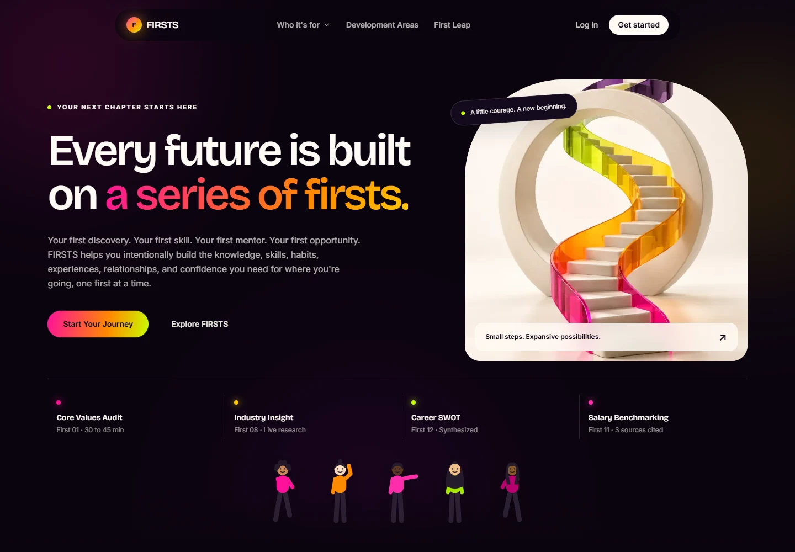
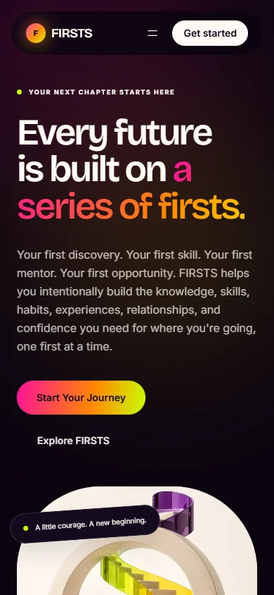

# FIRSTS platform design refresh

The existing citrus palette, typeface families, page content, routes, and application workflows are preserved. The homepage now moves from the introduction into actual product previews, the five pillars, and audience pathways. All original homepage sections remain.

## Design changes

- Editorial homepage and audience heroes with original artwork, readable module highlights, and more deliberate typography.
- Shared section rhythm and card treatments throughout public pages, including development areas and partner schools.
- Consistent surfaces, active navigation, and restrained entrance motion across student, advisor, institution, employer, facilitator, and admin workspaces.
- Three selectable, actual platform screenshots: dashboard, portfolio, and advisor workspace. These are explicitly labeled as example data.
- Responsive authentication artwork, mobile marketing navigation, Escape dismissal, keyboard focus indicators, and reduced-motion support.
- Responsive radar chart and tooltip positioning; the chart no longer expands the mobile dashboard.
- Existing Bricolage Grotesque and Inter fonts bundled locally with their SIL licenses so builds do not need Google Fonts access.

## Validation

- `next build`: production build and TypeScript checks passed, including 81 generated pages. Webpack production build also passed.
- ESLint across application source: no errors or warnings.
- 78 static routes checked at 390px: HTTP 200, no document overflow, no client runtime or hydration errors.
- Eight facilitator pages additionally checked with an accepted local test profile.
- Module, advisor cohort, and employer portfolio detail routes sampled successfully.
- Homepage, login, dashboard, onboarding, and partner-school pages also checked at 320px.
- Desktop and mobile navigation, Escape dismissal, product preview switching, and normal/reduced motion checked in a browser.
- Source AST comparison against the original branch found no removed JSX text. Existing content data files were not changed.

## Assets and provenance

Original artwork was created with the built-in image generation tool and saved as optimized WebP assets. The community image is illustrative generated imagery, not a photograph of FIRSTS customers.

| Asset | Use |
| --- | --- |
| `public/images/firsts-growth.webp` | Homepage, individual audience pages, authentication, dashboard |
| `public/images/firsts-community.webp` | Institutional audience pages, demo page, First Leap |
| `public/images/preview-dashboard.webp` | Actual local dashboard screenshot |
| `public/images/preview-portfolio.webp` | Actual local portfolio screenshot |
| `public/images/preview-advisor.webp` | Actual local advisor screenshot |

### Growth artwork prompt

Use case: stylized-concept. Asset type: premium FIRSTS career development website editorial artwork. Create a sophisticated tactile 3D sculpture of an ascending ribbon staircase looping through an open circular arch, representing first steps and personal growth. Portrait 3:4 composition, sculpture centered with generous negative space, warm ivory studio floor and background. Exact brand palette only: neon pink #ff1199, lime #c8ff00, orange #ff8a00, mango #ffc600, plum #7b007a, ivory #fffaf4, ink #0b0410. Satin ceramic and translucent colored resin, nuanced studio shadows, premium architectural art direction, beautiful physically plausible materials. No text, no letters, no logos, no UI, no watermark. Save the image as a project asset.

### Community artwork prompt

Use case: photorealistic-natural. Asset type: FIRSTS career development platform wide editorial image, landscape 3:2. Three diverse young adult students and one older female mentor working together around a large ivory table in a beautiful contemporary university creative studio, natural unposed conversation and smiling thoughtful expressions, notebooks and one laptop, authentic editorial photography with warm afternoon light and subtle film grain. Architecture and clothing coordinated to the FIRSTS palette: warm ivory #fffaf4, deep ink #0b0410, accents of fuchsia #ff1199, lime #c8ff00 and mango #ffc600. Restrained sophisticated composition with people clearly visible, no text, no logos, no watermarks, no legible laptop screen. Aspirational, human, candid.

## Review screenshots

